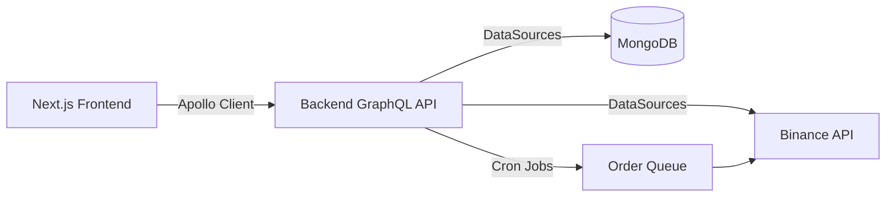

# CLAUDE.md

Guidelines for Claude Code when working with the Altcash monorepo. Review this before making changes to ensure tooling, architecture, and workflows stay aligned.

## Monorepo Overview

This repository is organized as a **Bun workspaces** monorepo housing both the frontend and backend applications:

```text
altcash-webapp/
├── packages/
│   ├── frontend/     # Next.js + React client (@altcash/frontend)
│   └── backend/      # Express + GraphQL server (@altcash/backend)
└── package.json      # Workspace configuration and shared scripts
```

## Package Manager & Root Scripts

**IMPORTANT:** All package management uses `bun`. Do **not** use npm or yarn.

````bash
# Install all workspace dependencies
bun install

# Add/remove packages scoped to a workspace
bun add <pkg> --filter frontend
bun remove <pkg> --filter backend

# Run workspace scripts
bun run --filter frontend <script>
bun run --filter backend <script>

# Root-level commands

```bash
bun dev            # Start frontend + backend together
bun dev:frontend   # Frontend only (port 3000)
bun dev:backend    # Backend only (port 4000)
bun build          # Build backend then frontend
bun build:frontend
bun build:backend
bun start:frontend
bun start:backend
bun lint           # Lint frontend
bun clean          # Remove node_modules/.next/dist
````

## Environment Configuration

- **Frontend (`packages/frontend/.env.local`):**

  ```bash

  ```

- **Backend (`packages/backend/.env`):**

  ```bash
  NODE_ENV=development
  PORT=4000
  SENDGRID_API_KEY=<value>
  CMC_PRO_API_KEY=<value>
  BINANCE_API_KEY=<value>
  BINANCE_API_SECRET=<value>
  BINANCE_API_KEY_TESTNET=<value>
  BINANCE_API_SECRET_TESTNET=<value>
  BINANCE_API_URL=https://api.binance.com
  ```

## Frontend (`packages/frontend`)

### Tech Stack & Tooling

- Next.js **15.5.6** (Pages Router)
- React **19.2.0** with TypeScript **5.9.3**
- Apollo Client **4.0.7** with `apollo3-cache-persist`
- MUI **v7.3.4** + `tss-react` for styling
- Emotion for SSR-compatible CSS-in-JS
- Bun scripts: `bun dev`, `bun run build`, `bun start`, `bun run lint`, `bun run fix-code`, `bun run export`

### Architecture Highlights

- **Atomic design:**
  - `src/components/atoms/`, `molecules/`, `organisms/`, `templates/`
  - Each folder typically includes an `index.tsx`, implementation file, and optional `use-styles.tsx`
- **Styling with `tss-react`:** always use `const { classes } = useStyles();` (never assign the hook return directly).
- **Apollo setup:**
  - Client configuration in `src/common/apollo/apollo-client.ts`
  - Cache defined in `src/common/apollo/apollo-cache.ts`
  - Operations stored under `src/graphql/`
- **Context providers:** `src/context/global.tsx`, `favourites.tsx`, `auth.tsx` (composed in `src/pages/_app.tsx`).
- **Utilities:** `src/common/utils.tsx` exposes `isServer()` to guard browser-only code.
- **Theme:** MUI theme in `src/common/theme.ts`; global CSS in `src/styles/global.css`.

### Notes & Known Issues

- Development SSR may emit a non-blocking “Element type is invalid…” warning from `tss-react`; it does not affect production builds.

## Backend (`packages/backend`)

### Project Overview

- GraphQL-based cryptocurrency exchange backend integrating Binance Spot API.
- Handles order lifecycle: creation, queueing, execution, and tracking.
- Built with Express + Apollo Server 3, TypeScript, and MongoDB.

### Development Commands

```bash
bun dev        # Nodemon + ts-node on port 4000
bun run build  # tsc build → dist/ and copy schema.graphql
bun start      # Alias for build (does not run server)
bun run lint
bun run fix-code
```

### Architecture & Data Flow

1. **Entry Point (`src/index.ts`):** connects to MongoDB, starts cron jobs, bootstraps Apollo server on Express.
2. **Order Processing Pipeline:**
   - Orders created via GraphQL mutations are persisted in MongoDB.
   - Cron (5s) `importAndCheckOrders` moves paid orders into the execution queue.
   - Cron (15s) `checkAndExecuteOrderQueue` executes queued orders on Binance (market buy, BTC quote only).
   - Queue documents track `isExecuted`, `isFilled`, `hasErrors`.
3. **DataSources (`src/datasources/`):**
   - `BinanceAPI` for Binance operations.
   - `OrdersAPI` for order CRUD.
   - `OrdersQueueAPI` encapsulates execution logic (`executeExchangeOrder` validates balances, posts orders, logs responses, marks errors).
   - `MetadataAPI`, `MybitxAPI`, `NamesAPI` for supplemental data.
4. **GraphQL Schema (`src/schema.graphql`):** schema-first approach with resolvers split under `src/resolvers/` and merged via `@graphql-tools/merge` inside `src/utilities/apollo.ts`.
5. **Caching:** default InMemoryLRUCache (~100 MiB, 5 min TTL) with `@cacheControl` directives; Redis cache available but disabled.

### Configuration & Constraints

- Environment variables listed above; `NODE_ENV` controls logging/TLS behaviour.
- Binance requirements: account must have `canTrade: true`, maintain ≥ 0.0006 BTC, trade BTC-quoted pairs only, and place market orders.
- MongoDB connection handled in `src/utilities/db.ts`.
- Binance responses are appended to `orderReferences` for auditing.
- Cron jobs defined in `src/utilities/cronlist.ts` (implemented with `setInterval`).
- Logging with Winston (`src/utilities/logger.ts`); production logs are written to `./altcash.log`.
- TypeScript config emits to `dist/`, enables source maps, sets `strict: false` and `noImplicitAny: true`, and uses `src/@types` as a type root.

## Full-Stack Workflow



1. Start the backend first so the GraphQL API is available:

   ```bash
   bun run --filter backend dev
   ```

2. Start the frontend:

   ```bash
   bun run --filter frontend dev
   ```

3. Or run `bun dev` at the root to launch both simultaneously.

## Common Development Tasks

- **Add a frontend feature:**
  1. Define or update GraphQL operations under `packages/frontend/src/graphql/`.
  2. Build UI components following the atomic structure and style with `tss-react`.
  3. Consume data using Apollo hooks (`useQuery`, `useMutation`, `useLazyQuery`).
  4. Update context providers or themes if shared state/UI changes are needed.

- **Extend backend schema/resolvers:**
  1. Update `packages/backend/src/schema.graphql`.
  2. Implement resolvers within `src/resolvers/` and include them in the merge map (`src/utilities/apollo.ts`).
  3. Extend or create DataSources in `src/datasources/` when new external access is required.
  4. Adjust models (`src/models/`) and TypeScript types (`src/types.ts`) when database structures evolve.

- **Database model change:** modify Mongoose models, regenerate associated types, update GraphQL schema/resolvers, and verify queue/order handling logic.

- **Debugging tips:**
  - Frontend: Bun dev runs with `NODE_OPTIONS='--inspect'` for Chrome DevTools; monitor browser console and Apollo DevTools.
  - Backend: inspect terminal output in development, or `altcash.log` otherwise; verify MongoDB connectivity as well as Binance credentials/balance when execution fails; inspect queue documents for `hasErrors`.

Follow these practices to keep both applications synchronized and maintain dependable behaviour across the monorepo.
